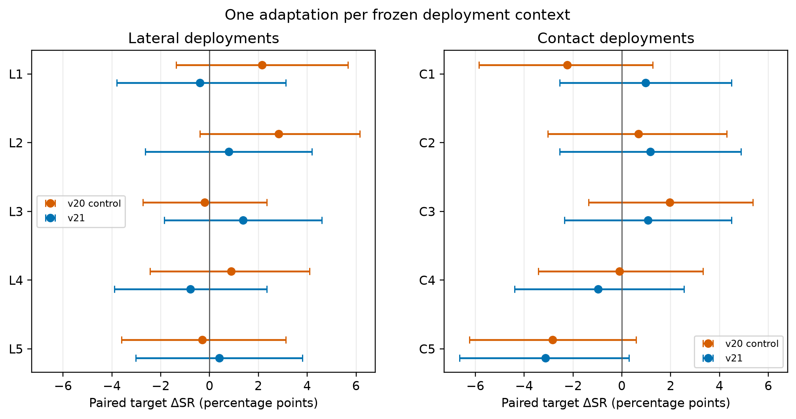
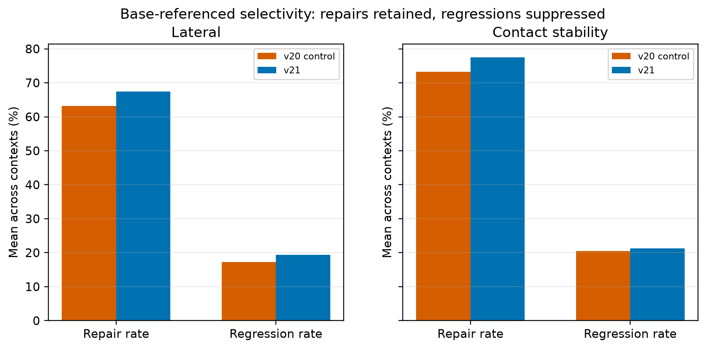
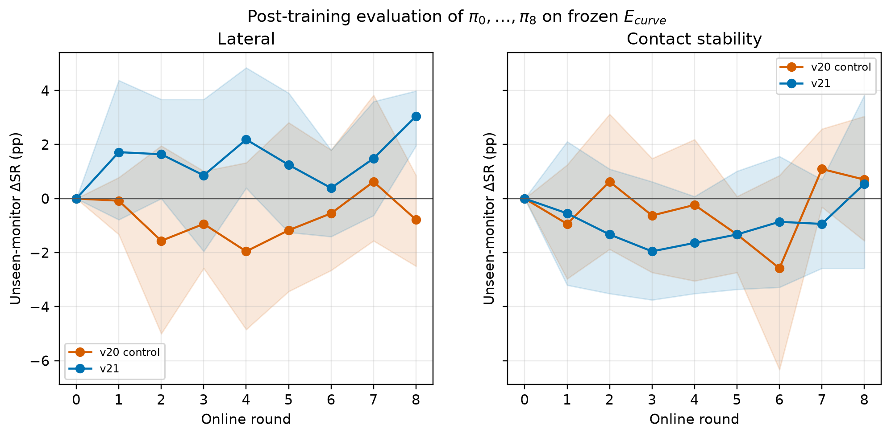

# Safe100 specialist v21 formal result / 正式结果

Status: the prospectively frozen v21 formal experiment is complete. All 20
adaptations, 20 unseen checkpoint monitors, 10 tri-policy audits, the aggregate,
and the figures finished on 2026-08-10. **Neither registered v21 mode claim
passed its formal gate.** No outcome-driven rerun or protocol change was made.

状态：前瞻冻结的 v21 正式实验已完成。20 个 adaptation、20 个 unseen
checkpoint monitor、10 个三策略 audit、总汇总和绘图均于 2026-08-10 完成。
**两个登记的 v21 mode claim 均未通过正式门槛。** 未进行结果导向的重跑，
也未修改协议。

## Primary result / 主要结果

The registered claim compares v21 with the common base actor. Its statistical
unit is one deployment context, not one episode. Confidence intervals below
are the prospectively specified 10,000-sample bootstrap across five contexts.

登记的主 claim 比较 v21 与共同 base actor。统计单位是 deployment context，
而不是单个 episode。下列置信区间是按预注册方案、在 5 个 context 间进行
10,000 次 bootstrap 得到。

| mode | target success delta | positive contexts | target fall delta | D0 success delta | formal gate | 95% LCB > 0 |
| :--- | ---: | ---: | ---: | ---: | :---: | :---: |
| lateral | **+0.273 pp** `[-0.391, +0.938]` | 3/5 | -0.273 pp `[-0.938, +0.391]` | -0.391 pp `[-2.813, +1.875]` | **fail** | no |
| contact stability | **-0.176 pp** `[-1.836, +1.094]` | 3/5 | +0.156 pp `[-1.133, +1.836]` | -0.625 pp `[-2.188, +0.938]` | **fail** | no |

The frozen gate required all four conditions: mean target success delta greater
than zero, at least four of five contexts positive, mean target fall delta no
greater than +3 percentage points, and mean D0 success delta no lower than
-5 percentage points. Lateral met the two mean safety bounds and had a positive
success point estimate, but only 3/5 contexts were positive. Contact met both
safety bounds, but its mean success point estimate was negative and only 3/5
contexts were positive.

冻结门槛要求四项同时成立：target success 平均变化严格大于 0、至少 4/5 个
context 为正、target fall 平均增幅不超过 3 个百分点、D0 success 平均降幅
不超过 5 个百分点。lateral 满足两个平均安全约束且 success 点估计为正，但
只有 3/5 个 context 为正；contact 满足两个安全约束，但 success 平均点估计
为负，且同样只有 3/5 为正。

## Comparators / 对照结果

All three policy roles were reconstructed from the same fresh paired audit
episodes in each context.

每个 context 中的三个策略角色均由同一批全新配对 audit episode 重建。

| mode | control - base | v21 - base | v21 - control |
| :--- | ---: | ---: | ---: |
| lateral target success | +1.074 pp `[-0.020, +2.168]` | +0.273 pp `[-0.391, +0.938]` | -0.801 pp `[-2.168, +0.664]` |
| contact target success | -0.508 pp `[-2.051, +1.035]` | -0.176 pp `[-1.836, +1.094]` | +0.332 pp `[-0.762, +1.855]` |

No comparison passed its corresponding four-condition mode gate. In
particular, none has a context-bootstrap target-success lower bound above zero.

所有比较都未通过对应的四条件 mode gate；尤其是所有 target-success 的
context-bootstrap 下界都没有高于 0。

## Per-context v21 result / 各 context 的 v21 结果

These are v21-minus-base target-success deltas from 1,024 fresh paired episodes
per policy and context.

下表是每个策略、每个 context 使用 1,024 个全新配对 episode 得到的
v21-minus-base target-success 变化。

| context | delta | paired-episode 95% CI |
| :--- | ---: | ---: |
| L1 | -0.391 pp | `[-3.809, +3.125]` |
| L2 | +0.781 pp | `[-2.637, +4.199]` |
| L3 | +1.367 pp | `[-1.855, +4.590]` |
| L4 | -0.781 pp | `[-3.906, +2.344]` |
| L5 | +0.391 pp | `[-3.027, +3.809]` |
| C1 | +0.977 pp | `[-2.539, +4.492]` |
| C2 | +1.172 pp | `[-2.539, +4.883]` |
| C3 | +1.074 pp | `[-2.344, +4.492]` |
| C4 | -0.977 pp | `[-4.395, +2.539]` |
| C5 | -3.125 pp | `[-6.641, +0.293]` |

## Secondary selectivity result / 次要选择性结果

The predeclared descriptive selectivity analysis is informative but does not
replace the primary raw-success gate. In contact stability, v21 versus control
increased the base-referenced conditional repair rate by **+4.296 pp**
`[+2.813, +5.970]`, changed the conditional regression rate by **+0.728 pp**
`[-0.785, +1.808]`, and increased repair-minus-regression by **+3.568 pp**
`[+1.113, +6.770]`. This is a positive secondary signal even though the contact
raw-success claim failed.

预先声明的描述性选择性分析具有参考价值，但不能替代主要 raw-success gate。
在 contact stability 中，v21 相对 control 的 base-referenced 条件 repair rate
提高 **+4.296 pp** `[+2.813, +5.970]`，条件 regression rate 变化
**+0.728 pp** `[-0.785, +1.808]`，repair-minus-regression 提高
**+3.568 pp** `[+1.113, +6.770]`。这是一个正向次要信号，但 contact 的
raw-success 主 claim 仍然失败。

For lateral, the corresponding repair-minus-regression change was +2.188 pp
`[-7.113, +13.998]`; the interval includes zero, and the regression-rate change
was +2.094 pp `[+0.355, +4.177]`.

lateral 的 repair-minus-regression 对应变化为 +2.188 pp
`[-7.113, +13.998]`，区间包含 0；regression-rate 变化为 +2.094 pp
`[+0.355, +4.177]`。

## Training gates and unseen monitors / 训练门控与 unseen monitor

Every adaptation used the frozen eight-round budget. Accepted-update totals
were 13 control and 18 v21 updates in lateral, and 13 control and 15 v21 updates
in contact. The C5 D0 gate prevented three target-acceptable but retention-unsafe
updates: control rounds 5 and 7, and v21 round 6. Each was rolled back to the
previous D0-safe checkpoint.

每个 adaptation 均使用冻结的 8 轮预算。lateral 共接受 control 13 次、v21
18 次更新；contact 共接受 control 13 次、v21 15 次。C5 的 D0 gate 阻止了
3 个 target 可接受但 retention 不安全的更新：control round 5、7，以及 v21
round 6；三者均回滚到此前的 D0-safe checkpoint。

The post-training frozen monitor evaluated all nine saved checkpoints with 256
paired conditions per role and context. Its round-8 mean success deltas from
round 0 were:

训练结束后的冻结 monitor 使用每个角色、每个 context 的 256 个配对条件评价
全部 9 个 checkpoint。round 8 相对 round 0 的平均成功率变化为：

| mode | control | v21 |
| :--- | ---: | ---: |
| lateral | -0.781 pp `[-2.500, +0.859]` | +3.047 pp `[+1.953, +3.986]` |
| contact stability | +0.703 pp `[-1.563, +3.047]` | +0.547 pp `[-2.578, +3.828]` |

These monitors were accessed only after every checkpoint had been saved. They
are diagnostic learning curves, not training selectors and not substitutes for
the fresh formal audit.

这些 monitor 仅在所有 checkpoint 保存后才被访问，是诊断性学习曲线，不是
训练选择器，也不能替代全新的正式 audit。

## Interpretation and limitations / 解释与限制

- Development prospectively selected **beta = 0**. Consequently the registered
  v21 and control actor objectives are identical; the two roles were still run
  independently as registered. Their numerical differences therefore describe
  independent execution variability, not an identified effect of a nonzero
  matched-success term.
- The authoritative formal result is negative: this experiment does not support
  a claim that v21 reliably improves target success across deployments.
- The contact selectivity result is a useful hypothesis for a future protocol,
  but it was not a post-hoc replacement endpoint and does not rescue the failed
  primary gate.
- Independent GPU simulator executions can show residual nondeterminism even
  with the same actor and seed. Pairing within each audit protects each reported
  comparison, but cross-run monitor-versus-audit differences should not be read
  as exact replication.
- This is simulation-only evidence and makes no real-robot or sim-to-real claim.

- 开发阶段前瞻选择了 **beta = 0**，因此登记的 v21 与 control actor objective
  完全相同；两者仍按登记方案独立运行。它们的数值差异反映独立执行波动，不能
  解释为非零 matched-success 项的因果效果。
- 权威正式结论为负：本实验不支持“v21 能跨 deployment 稳定提高 target
  success”的 claim。
- contact 选择性结果可作为后续协议的假设，但它不是事后替换的 endpoint，
  不能挽救失败的主门槛。
- 即使 actor 与 seed 相同，独立 GPU 仿真执行仍可能有残余非确定性。每次 audit
  内部的配对保护了所报告比较，但 monitor 与 audit 的跨运行差异不应视为精确
  复现。
- 本结果仅来自仿真，不构成真实机器人或 sim-to-real claim。

## Frozen scope and integrity / 冻结范围与完整性

- Formal contexts: five lateral (`L1`--`L5`) and five contact-stability
  (`C1`--`C5`).
- Adaptations: 10 contexts x 2 independently executed roles = 20; eight rounds
  per adaptation.
- Fresh audit: 1,024 paired target episodes and 256 paired D0 episodes per
  policy and context, for 1,280 tri-policy paired rows per context.
- Protocol commit: `833099b2e7e03974cf93e1216e925444de1904c6`.
- Protocol SHA-256: `7ffc0d31733735cb570d72ea2fd0ab833dad5efd033bac71681021d564aa5d67`.
- Formal results SHA-256: `1d664ad127e4a4752ab70909859eedda80ac928899680c4752e5c735cec29972`.
- Artifact manifest SHA-256: `a4ea41a81eb5c81d54b39e2f80fc2958e2f5b94c6ad74fa8b6c0106b510c82d2`.
- Figure manifest SHA-256: `2c684ca138e163508e4c1b81abdefe34abb0ea041330a1a974bd2d17383e6db1`.
- Independent verification checked 128 bound files with zero hash or byte-count
  errors. Compact table row counts were 60, 42, 3,939, 240, 216, and 180.
- The formal queue recorded `queue_completed`; no experiment process or tmux
  session remained afterward.

Machine-readable results are in
[`results/online/specialist_v21/formal/`](../results/online/specialist_v21/formal/),
figures and their hashes are in
[`results/online/specialist_v21/figures/`](../results/online/specialist_v21/figures/),
the frozen design is in
[`DEPLOYMENT_V21_PROTOCOL.md`](DEPLOYMENT_V21_PROTOCOL.md), and the excluded
development selection is in
[`DEVELOPMENT_V21_RESULTS.md`](DEVELOPMENT_V21_RESULTS.md).
