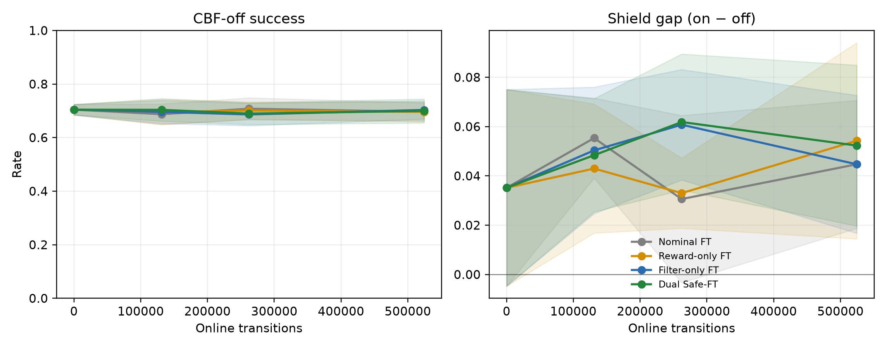
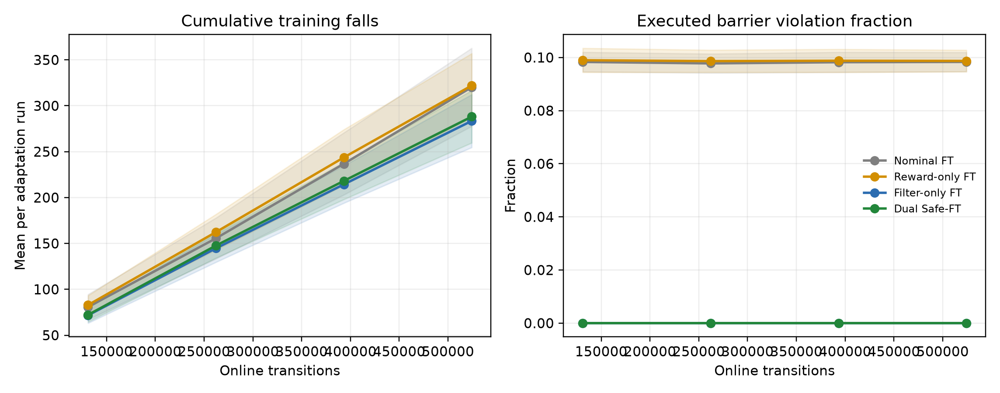

# Filter-free deployment ablation

| Arm | Filter | CBF reward | F1 off | F2 off | F3 off | Mean off | Off Δ | Shield gap | Training falls |
|---|---:|---:|---:|---:|---:|---:|---:|---:|---:|
| Frozen | — | — | 0.730 | 0.689 | 0.693 | 0.704 | +0.000 | +0.035 | — |
| Nominal FT | Off | No | 0.736 | 0.680 | 0.674 | 0.697 | -0.008 | +0.045 | 960.7 |
| Reward-only FT | Off | Yes | 0.731 | 0.671 | 0.686 | 0.696 | -0.008 | +0.054 | 966.0 |
| Filter-only FT | On | No | 0.738 | 0.707 | 0.665 | 0.703 | -0.001 | +0.045 | 850.3 |
| Dual Safe-FT | On | Yes | 0.754 | 0.675 | 0.670 | 0.700 | -0.005 | +0.052 | 864.3 |

Main claim supported: **False**.

The claim is enabled only when Dual Safe-FT has both the best round-4 CBF-off success and the lowest nominal violation rate across all five main-table methods, including Frozen.

Global fall- and executed-violation-free training supported: **False**.
The filtered arms are reported as local barrier-safety improvements, not as globally fall-free adaptation, whenever this check is false.

## CBF-dependence diagnostics

| Arm | Would intervene | Correction norm | Nominal violation/riser | Shield gap |
|---|---:|---:|---:|---:|
| Frozen | 0.1011 | 0.0209 | 5.1342 | +0.0352 |
| Nominal FT | 0.0989 | 0.0201 | 5.0179 | +0.0447 |
| Reward-only FT | 0.0986 | 0.0204 | 4.9970 | +0.0543 |
| Filter-only FT | 0.0978 | 0.0197 | 4.9450 | +0.0447 |
| Dual Safe-FT | 0.0983 | 0.0233 | 4.9668 | +0.0523 |

## Report-only paired 95% intervals

| Arm | CBF-off improvement | 95% CI | Shield gap | 95% CI |
|---|---:|---:|---:|---:|
| Nominal FT | -0.008 | [-0.026, +0.011] | +0.045 | [+0.025, +0.065] |
| Reward-only FT | -0.008 | [-0.028, +0.011] | +0.054 | [+0.032, +0.077] |
| Filter-only FT | -0.001 | [-0.019, +0.017] | +0.045 | [+0.023, +0.066] |
| Dual Safe-FT | -0.005 | [-0.027, +0.017] | +0.052 | [+0.026, +0.081] |

Intervals resample adaptation seeds and paired episodes while holding the three deployment contexts fixed and equally weighted. They are descriptive and do not alter the pre-registered claim gate.

## Report-only 2×2 factorial contrasts

| Metric | Reward effect, filter off | Reward effect, filter on | Filter effect, no reward | Filter effect, reward | Interaction |
|---|---:|---:|---:|---:|---:|
| mean_cbf_off_success_rate | -0.00065 | -0.00369 | +0.00673 | +0.00369 | -0.00304 |
| mean_cbf_off_nominal_violation_steps_per_riser | -0.02089 | +0.02174 | -0.07281 | -0.03018 | +0.04263 |
| mean_cbf_off_would_intervene_fraction | -0.00035 | +0.00043 | -0.00113 | -0.00034 | +0.00078 |
| mean_cbf_off_counterfactual_correction_norm | +0.00027 | +0.00362 | -0.00042 | +0.00293 | +0.00334 |
| mean_shield_gap | +0.00955 | +0.00760 | +0.00000 | -0.00195 | -0.00195 |
| training_falls_mean | +5.33333 | +14.00000 | -110.33333 | -101.66667 | +8.66667 |
| training_shield_recoveries_mean | +0.00000 | +215.00000 | +148980.00000 | +149195.00000 | +215.00000 |
| training_nominal_violation_fraction_mean | +0.00039 | +0.00013 | -0.00359 | -0.00384 | -0.00025 |
| training_executed_violation_fraction_mean | +0.00039 | -0.00000 | -0.09831 | -0.09870 | -0.00039 |

These contrasts are descriptive consequences of the matched 2×2 ablation and do not alter the pre-registered claim gate.

